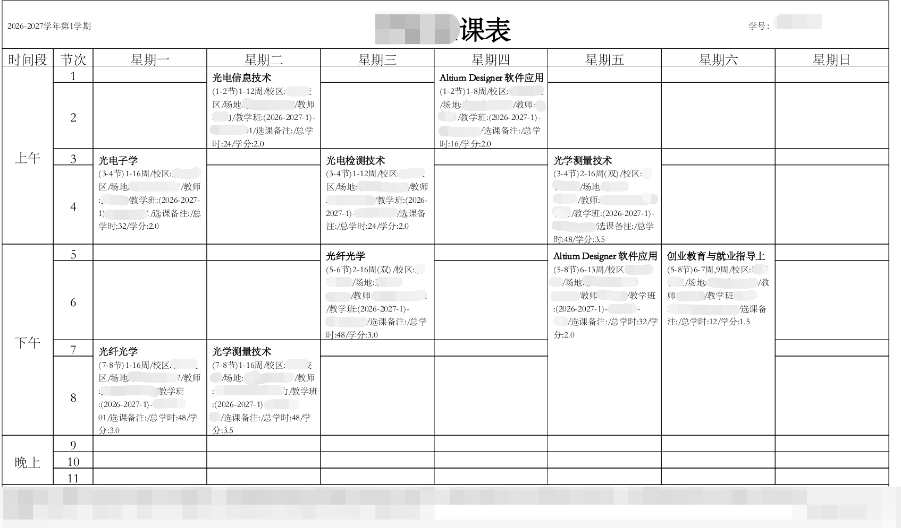
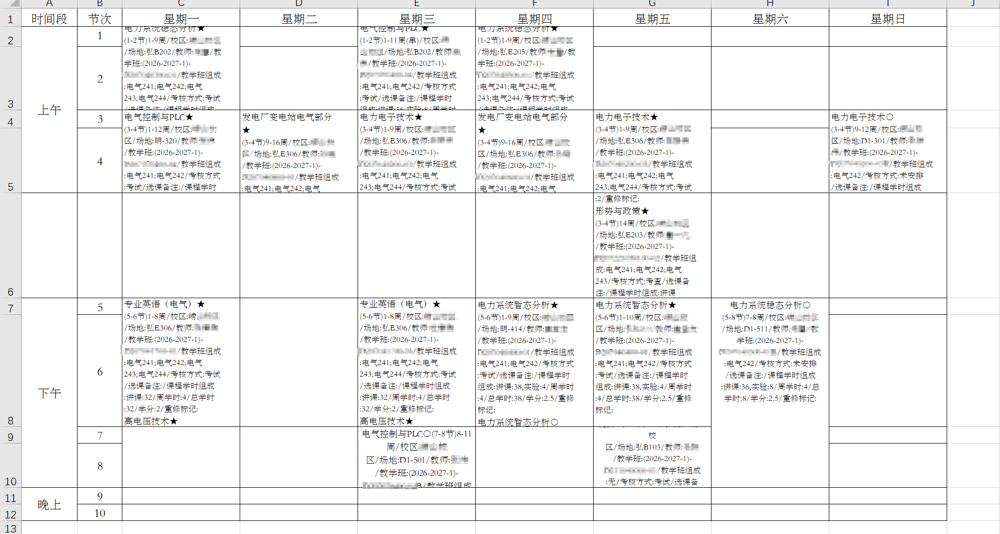

# Re课表

离线读取 `.xlsx` 和文字型 `.pdf` 的 Flutter 手机课表。课程和学期信息仅保存在设备本地，开源无广告。

## 如何使用

点开设置，选择学期的第一周，导入如下图的Excel或PDF，即可。

PS：若节课时间不对可在每周课表中调整默认时间

## 导入边界

- 支持现代 Excel `.xlsx` 网格课表。
- 支持带可提取文字的 PDF，以及 `/UniGB-UCS2-H` 字体映射缺失的教务系统 PDF。
- 不支持 `.xls`、CSV、图片、扫描件或加密 PDF。
- 导入前提供课程校对；确认后在单个数据库事务中替换当前课表。
